# Ticket Rush

> 선착순 이벤트/티켓팅 API 서버를 구축하기 위해 단계적으로 학습하며 솔루션을 적용해보는 오픈 미션 프로젝트입니다.

> 프로젝트에 대한 전체 설명과
> 소감문은 [오픈 미션: Ticket Rush 프로젝트 소감문](https://accidental-radon-18f.notion.site/Ticket-Rush-2ac6fd8c80d280c0a545cb5b5b16de0b)
> 을 참고해주세요!

## 프로젝트 설정 방법

> Docker를 통해 MySQL, Redis 데이터베이스를 컨테이너로 구성하고, 이를 연결하기 위한 설정 방법을 기술하였습니다.

1. Docker 공식 홈페이지나 구글 검색을 통해 Docker Desktop을 설치한다.
    - [Docker 공식 홈페이지](https://www.docker.com/)
    - [Junesker 티스토리: Docker 설치 방법](https://junesker.tistory.com/94)

2. 아래 형식과 같이 `application-local.yml`, `env` 파일을 작성한다.
    - 데이터베이스 이름, 비밀번호, 포트 번호는 2개 파일 모두 동일하게 작성해야 한다.

`application-local.yml` 파일

```yaml
local-db:
  mysql:
    host: localhost
    port: ${사용할 포트 번호} # 3306, 3307 등
    name: ${사용할 데이터베이스 이름} # ticketrush, mydb 등
    password: ${사용할 데이터베이스 비밀번호} # 12345678, ticketpassword 등

  redis:
    host: localhost
    port: ${사용할 포트 번호} # 6379 등
    password: ${사용할 데이터베이스 비밀번호} # 12345678, redispassword 등
```

`.env` 파일

```text
MYSQL_DATABASE=${사용할 데이터베이스 이름} # ticketrush, mydb 등
MYSQL_ROOT_PASSWORD=${사용할 데이터베이스 비밀번호} # 12345678, ticketpassword 등 
MYSQL_PORT=${사용할 포트 번호} # 3306, 3307 등

REDIS_PORT=${사용할 포트 번호} # 6379 등
REDIS_PASSWORD=${사용할 데이터베이스 비밀번호} # 12345678, redispassword 등
```

3. `docker-compose.yml` 파일이 있는 경로(프로젝트 최상단 경로)에서
   아래 명령을 실행하여 컨테이너를 생성한다.
    - 파일에 적힌 명령어와 설정 값이 궁금하다면 Docker Hub에 있는 MySQL, Redis 이미지 공식 홈페이지를 참고한다.
    - [MySQL 공식 이미지 홈페이지](https://hub.docker.com/_/mysql)
    - [Redis 공식 이미지 홈페이지](https://hub.docker.com/_/redis)

```text
# 컨테이너 생성
docker-compose up -d

---

# 컨테이너 재시작 등 모두 삭제했다가 다시 구성하고 싶은 경우 사용
# 컨테이너 삭제
docker-compose down

# 컨테이너와 볼륨 모두 삭제
docker-compose down -v
```

## 포트 별 서버 실행 방법 (서버 2대 실행 방법)

`cmd`, `Powershell`, `bash`와 같은 터미널 창에서 프로젝트 최상단 경로로 이동한 후, 아래 명령어를 실행한다.

```text
# application-server1.yml (profile=server1)로 서버 실행 (포트 번호: 8080)
./gradlew bootRun --args='--spring.profiles.active=server1'

# application-server2.yml (profile=server2)로 서버 실행 (포트 번호: 8081)
./gradlew bootRun --args='--spring.profiles.active=server2'
```

## 기능 요구 사항

100명에게만 선착순으로 이벤트(쿠폰, 티켓 등)를 제공하는 API 서버를 구축한다.

- 문제 상황을 재현하기 위해 쿠폰 또는 티켓과 같이 **동시성 문제가 발생하는** 도메인을 간단하게 설계한다.
- 이벤트를 신청, 재고 확인, 재고 차감, 신청 내역 저장 등 이벤트를 반영할 수 있는 간단한 API를 설계한다.
- 동시성을 제어할 수 있는 여러 기법을 학습하고 적용해보기 위해, **단계별 적용 가이드**를 참고하여 순서대로 구현한다.
- 동시성 문제를 해결하였음을 검증할 수 있는 기법(테스트 코드, 모니터링, 또는 기타 도구)을 학습하여 적용한다.
- Git의 커밋 단위는 **단계별 적용 가이드**에 있는 각 단계를 참고한 다음, 기능 목록을 별도로 작성하여 이에 맞춰 추가한다.

## 단계별 적용 가이드

### Level 0

- 문제 상황을 가정하기 위해 티켓을 관리하는 `Ticket`과, 티켓을 구매한 사용자를 나타내는`TicketOrder` 도메인을 설계한다.
    - 예제를 단순화 하기 위해 사용자를 나타내는 `User`나 `Member` 엔티티를 별도로 구성하지 않고,
      `TicketOrder`에 `userId` 필드를 가지고 있는 것으로 구성한다.
    - `UNIQUE Constraint`를 설정하여 중복 구매를 방지한다.
- 도메인에 설계 후 실제 데이터베이스(MySQL, PostgreSQL 등)를 연결한다.
- 도메인에 맞는 적절한 연산(데이터 삽입, 조회 등)을 구성하기 위해 MVC 패턴을 적용한 REST API를 설계한다.
- 설계한 도메인과 API가 정상적으로 잘 동작하는 지 POSTMAN으로 테스트한다.
- `AtomicInteger`, `ExecutorService`, `CountDonwLatch` 클래스를 사용하여 여러 스레드를 생성하고
  동시에 티켓을 구매하는 테스트 코드를 작성한다.

### Level 1

- `synchronized`를 학습하고 동시성 문제를 해결한다.
- `ReentrantLock`를 학습하고 동시성 문제를 해결한다.

### Level 2

- `비관적 락(Pessimistic Lock)`을 학습하고 동시성 문제를 해결한다.
- `낙관적 락(Optimistic Lock)`을 학습하고 동시성 문제를 해결한다.

### Level 3

- `Redisson 분산 락`을 학습하고 동시성 문제를 해결한다.

## 프로그래밍 요구사항

- `Java Style Guide`를 원칙으로 하여 자바 코드 컨벤션을 지키면서 프로그래밍한다.
- **동시성 제어**라는 고난도 기술을 처음 공부해보고 접하는 단계이므로, LLM 이나 AI를 사용하여 참고할 수 있다.
    - 프로젝트 구현을 위해 처음부터 끝까지 물어보는 방식이 아닌, 이론적으로 학습해야할 방향성에 대한 질문 허용
    - 이론적으로 학습한 제어 기법을 어떻게 적용해야 하는지 예시 코드 요청 허용

## 기능 목록

- [x] 문제 상황에 적합한 도메인을 설계한다. (`Ticket`, `TicketOrder` 등)
- [x] 설계한 도메인의 데이터를 저장할 수 있는 MySQL 데이터베이스를 연결한다.
- [x] 데이터 삽입, 조회와 같은 연산이 가능한 API를 설계한다.
- [x] `POSTMAN`을 통해 설계한 API가 정상적으로 동작하는지, 데이터가 데이터베이스에 정상적으로 저장되는 지 확인한다.
- [x] 동시성 문제를 보여줄 수 있는 테스트 코드를 작성한다.
- [x] `synchronized`를 사용하여 동시성 문제를 해결한다.
- [x] `ReentrantLock`을 사용하여 동시성 문제를 해결한다.
- [x] `비관적 락(Pessimistic Lock)`을 사용하여 동시성 문제를 해결한다.
- [x] `낙관적 락(Optimistic Lock)`을 사용하여 동시성 문제를 해결한다.
- [x] `Redis` 데이터베이스를 사용하기 위해 MySQL 외에 추가로 연결 작업을 진행한다.
- [x] `Redisson 분산 락`을 사용하여 동시성 문제를 해결한다.

## 동시성 문제 해결 결과

> 각 레벨 별로 동시성 문제가 해결되었음을 검증한 결과물
(테스트 코드 실행 결과, JMeter 부하 테스트 결과)과 함께 간단한 설명을 기술하였습니다.

> 동시성 문제 해결 과정에 대한 **자세한 설명**은
[오픈 미션: Ticket Rush 프로젝트 소감문, 동시성 문제 해결 과정(Notion)](https://accidental-radon-18f.notion.site/Ticket-Rush-2ac6fd8c80d280c0a545cb5b5b16de0b?pvs=97#2ac6fd8c80d2801988f5cd3aeeebd52f)
> 을 참고해 주시면 감사하겠습니다.

### Level 0

#### 1. 테스트 코드 실행 결과 (TicketServiceTest)

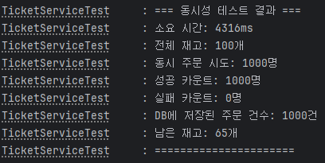

재고가 총 100개인 티켓을 동시에 1000명이 주문하고자 시도하였다.

현재 Level 0은 동시성 제어가 없는 코드이므로, **1000명 모두 성공하고 재고가 65개 남아있는 치명적인 문제점이 발생하였다.**

즉, 각 스레드의 접근 속도가 너무 빠른 나머지 하나의 재고를 두고 2개 이상의 스레드가 동시에 접근하는
**경쟁 조건(Race Condition)** 이 발생한 것이다.

#### 2. JMeter 테스트 결과 (API Test)

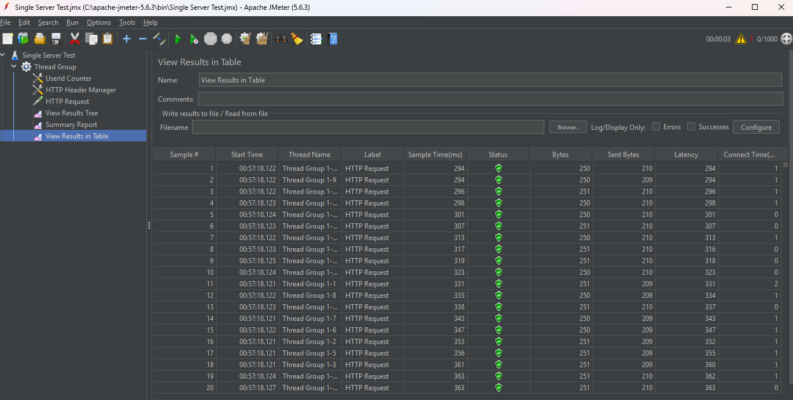

JMeter로 실행해본 결과 역시 API 요청이 모두 성공하였으며,
1000명의 사용자가 모두 주문에 성공하였다는 동시성 문제가 발생하였다.

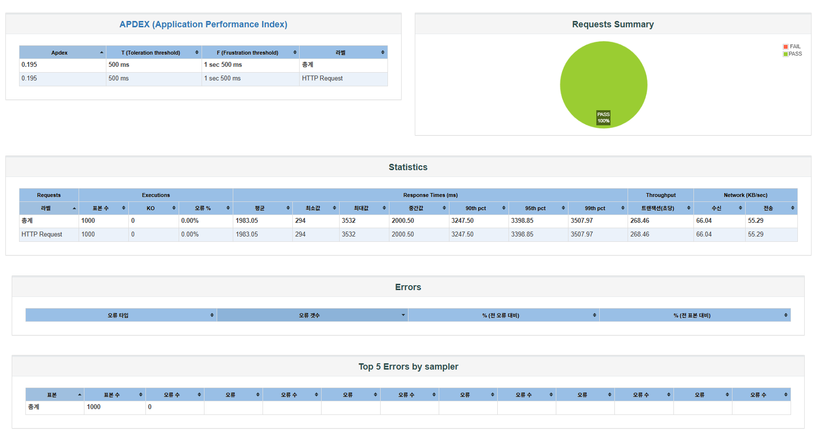

JMeter 기능 중 하나인 `HTML report`를 통해 보고서를 생성해보았다.
전체 통계 결과에서도 모든 요청이 성공하였음을 확인할 수 있다.

### Level 1

### synchronized

#### 1. 테스트 코드 실행 결과

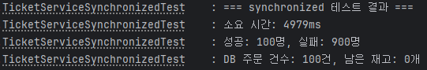

`synchronized` 키워드를 통해 동시성 제어를 구현한 결과이다.

재고 100개를 기준으로 1000명 사용자가 동시 접속한 결과
**정확히 100명은 성공했고, 나머지 900명은 실패**하였음을 확인할 수 있다.

#### 2. JMeter 테스트 결과 (API Test)

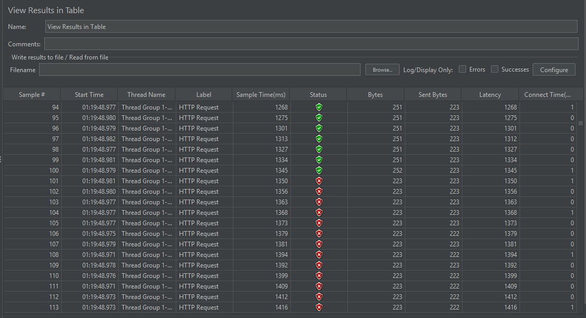

JMeter로 성능 부하를 테스트한 결과 처음 접속한 100개의 스레드는 정상적으로 주문에 성공하였고, 이후에 접근한 스레드는 티켓 재고가 존재하지 않아 주문에 실패하였다.

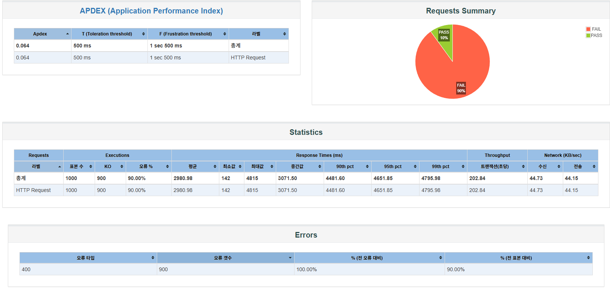

보고서 결과 역시 전체 요청 중 `10%(100명)은 성공`하였고, `90%(900명)은 실패`하였다는 결과가 출력되었다.

### ReentrantLock

#### 1. 테스트 코드 실행 결과

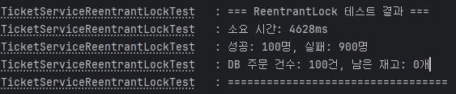

#### 2. JMeter 테스트 결과 (API Test)

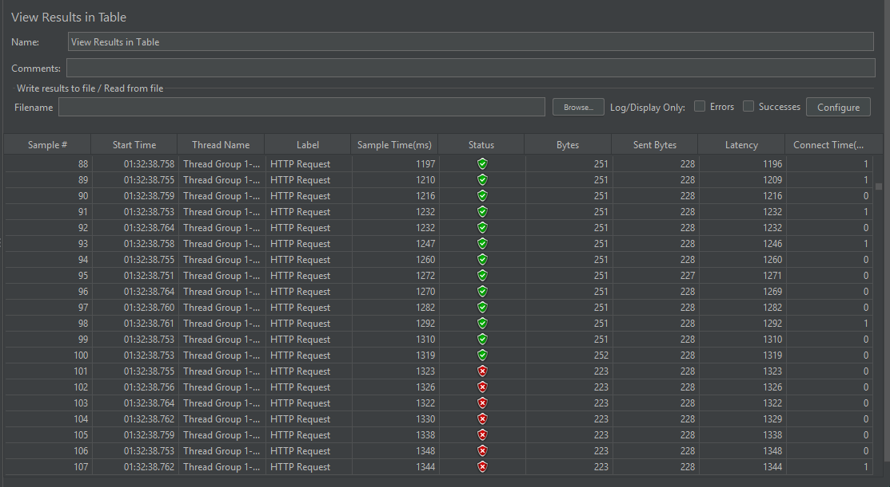

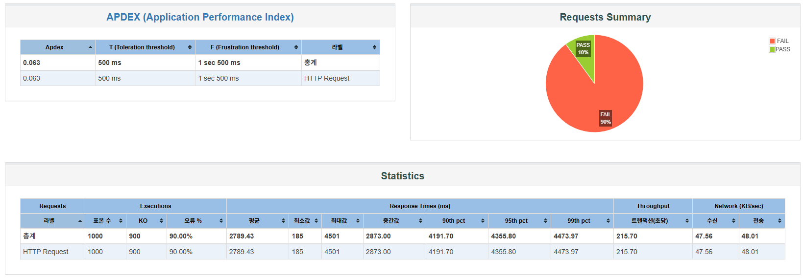

`ReentrantLock` 클래스를 통해 구현한 결과이다. 동시성 제어 결과는 `synchronized`와 동일하므로 설명은 생략하겠다.

### synchronized & ReentrantLock 한계점

`synchronized`, `ReentrantLock` 모두 단일 서버, 단일 JVM 에서만 동시성 제어가 가능하다는 한계점이 있다.

즉, 백엔드 서버가 2대만 되어도 해결한줄 알았던 동시성 문제는 다시 나타난다.

8080, 8081 포트로 2대의 서버를 실행한 후, 아래 사진과 같이 쓰레드 그룹을 2개로 나누어
8080과 8081 포트 서버에 티켓 주문 요청을 분산시켜서 테스트해 보았다.

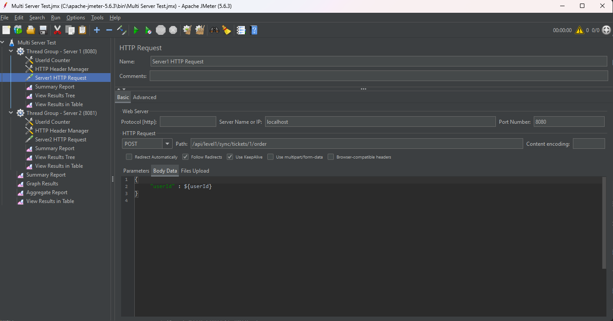

실행 결과 PASS 값이 10% 이어야 정상적인 상황(1000명 중 100명 주문 성공)에서 `17.7%` 수치를 기록하였다.

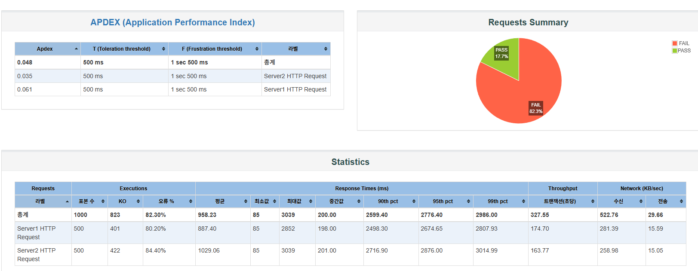

100명만 성공해야 하는 티켓 구매가 177명이 성공했다는 뜻이며, 동시성 문제가 다시 발생하였음을 확인하였다.

### Level 2

다중 서버 환경에서는 동시성 제어가 불가능하다는 Level 1의 한계점을 극복하기 위해,
데이터베이스 레벨에서 동시성을 제어하는 새로운 기법이 필요하다.

낙관적, 비관적 락은 데이터베이스 레벨에서 동시성을 제어해주는 기법이다.

### 낙관적 락(Optimistic Lock)

#### 1. 테스트 코드 실행 결과

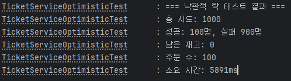

낙관적 락을 통해 구현한 결과이다. 전체 사용자 1000명 중 100명이 성공하고,
나머지 900명은 실패하였음을 확인할 수 있다.

테스트 코드는 단일 서버에서 실행한 것과 동일하므로,
`synchronized`, `ReentrantLock`과 비교하였을 때 차이점이 존재하지 않는다.

#### 2. JMeter 테스트 결과 (API Test)

서버 2대 포트를 각각 8080, 8081로 설정하여 실행한 후, API 요청을 진행한 결과이다.

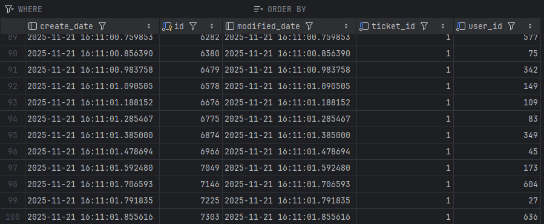

`ticket_orders` 테이블에 저장된 결과를 보면, 티켓 주문 수량이 정확히 100개인 것을 확인할 수 있다.


PASS는 10%, FAIL이 90% 이므로 총 1000명 사용자 중 100명만 티켓 주문에 성공했다.

즉, Level1 에서는 극복하지 못하였던 **다중 서버에서의 동시성 문제**를 해결하였다는 의미이다.

### 비관적 락(Pessimistic Lock)

#### 1. 테스트 코드 실행 결과


비관적 락을 통해 구현한 테스트 코드 실행 결과이다. 낙관적 락과 동일한 결과임을 확인할 수 있다.

#### 2. JMeter 테스트 결과 (API Test)

낙관적 락과 동일하게 서버 2대인 환경에서 테스트한 결과이다.

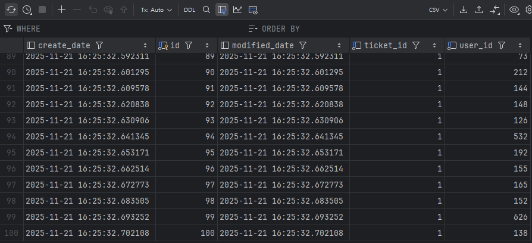

`ticket_orders` 테이블에 저장된 결과를 보면,
낙관적 락과 동일하게 티켓 주문 수량이 총 100개임을 확인할 수 있다.

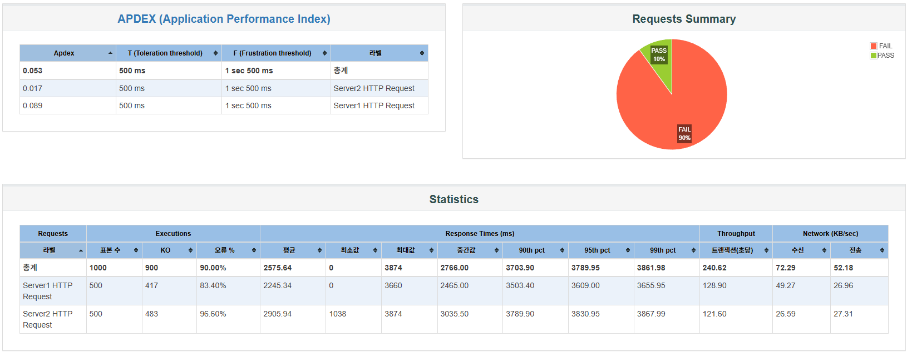

JMeter를 사용한 HTML 보고서 통계 역시 10% PASS, 90% FAIL 이므로
총 1000명 중 100명만 티켓 주문에 성공하였음을 확인할 수 있다.

### 낙관적 & 비관적 락의 한계점

앞서 언급했듯이, 낙관적 & 비관적 락 모두 데이터베이스 레벨에서 동시성을 제어하는 기법이다.

따라서 DB가 여러 개인 **다중 데이터베이스** 환경에서는 해당 기법으로 동시성 제어가 불가능하다.

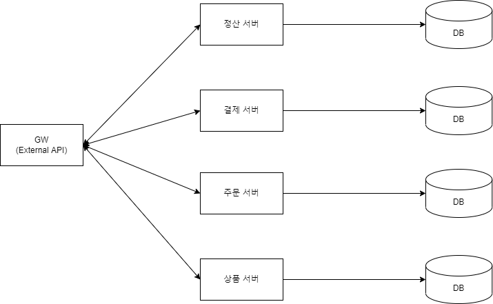

(출처: https://velog.io/@hgs-study/redisson-distributed-lock)

이 경우 사용해 볼 수 있는 방법은 Redis 분산 락을 추가로 배치하여
데이터베이스의 정합성을 준수하는 것이다.

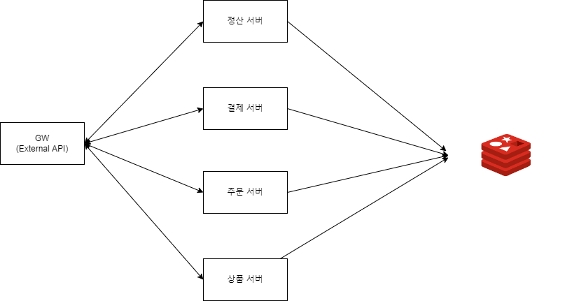

(출처: https://velog.io/@hgs-study/redisson-distributed-lock)

### Level 3

### Redisson 분산 락

Redisson은 Redis 클라이언트 중 하나로, 자체 TTL을 제공하고 Pub/Sub 기반으로 동작한다.

분산락 기능을 고수준으로 추상화하여 제공하므로, 락 획득, 해제, 자동 연장 등 복잡한 로직을 직접 작성할 필요 없이 간단한 API 호출만으로 분산락을 사용할 수 있다.

#### 1. 테스트 코드 실행 결과

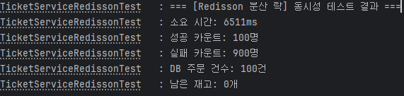

테스트 코드 실행 결과 성공 900명, 실패 100명으로 정상적으로 티켓 주문에 성공한 것을 확인할 수 있다.

#### 2. JMeter 테스트 결과 (API Test)

낙관적 & 비관적 락과 동일하게 2대의 서버를 구성하여 테스트한 결과이다.

Level 2의 낙관적 & 비관적 락 방식의 한계점을 해결하였음을 검증하기 위해서는 다중 데이터베이스 구성이 필요했으나,

설계 및 구현 상의 높은 복잡도로 인해 실제 테스트 환경 구축에는 제약이 있었다.

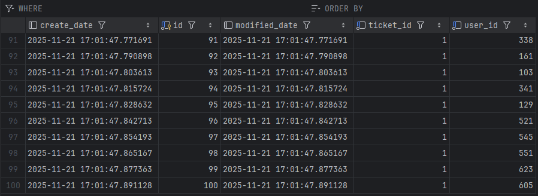

`ticket_orders` 테이블에 저장된 결과를 보면 티켓 주문 수량이 총 100개임을 확인하였다.


JMeter HTML 보고서 결과 역시 `10% PASS`, `90% FAIL`로 총 1000명 사용자 중 100명이 티켓 주문에 성공하였음을 확인할 수 있다.
